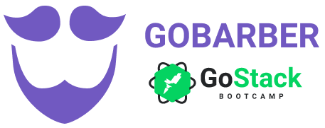

<h1 align="center">
    
    <br>
    GoBarber API
</h1>

<h4 align="center">
  An API made to serve the GoBarber platform, including the web and mobile version.
</h4>
<p align="center">
  

  

  
  <a href="https://github.com/matheuskuster/gostack-gobarber-api/commits/master">
    
  </a>

  
</p>

## :rocket: Technologies

This project was developed at the [RocketSeat GoStack Bootcamp](https://rocketseat.com.br/bootcamp) with the following technologies:

- [Node.js](https://nodejs.org/en/)
- [Express](https://expressjs.com/)
- [nodemon](https://nodemon.io/)
- [Sucrase](https://github.com/alangpierce/sucrase)
- [Docker](https://www.docker.com/docker-community)
- [Sequelize](http://docs.sequelizejs.com/)
- [PostgreSQL](https://www.postgresql.org/)
- [node-postgres](https://www.npmjs.com/package/pg)
- [Redis](https://redis.io/)
- [MongoDB](https://www.mongodb.com/)
- [Mongoose](https://mongoosejs.com/)
- [JWT](https://jwt.io/)
- [Multer](https://github.com/expressjs/multer)
- [Bcrypt](https://www.npmjs.com/package/bcrypt)
- [Youch](https://www.npmjs.com/package/youch)
- [Yup](https://www.npmjs.com/package/yup)
- [Bee Queue](https://www.npmjs.com/package/bcrypt)
- [Nodemailer](https://nodemailer.com/about/)
- [date-fns](https://date-fns.org/)
- [Sentry](https://sentry.io/)
- [DotEnv](https://www.npmjs.com/package/dotenv)
- [VS Code](https://code.visualstudio.com/) with [ESLint](https://marketplace.visualstudio.com/items?itemName=dbaeumer.vscode-eslint)

## :information_source: How To Use

To clone and run this application, you'll need [Git](https://git-scm.com), [Node.js v10.16](https://nodejs.org/) or higher, [Yarn v1.13](https://yarnpkg.com/) or higher installed on your computer. From your command line:

```bash
# Clone this repository
$ git clone https://github.com/matheuskuster/gostack-gobarber-api

# Go into the repository
$ cd gostack-gobarber-api

# Install dependencies
$ yarn install

# Run it with nodemon
$ yarn dev

# Or run it directly with node
$ yarn start

```

<details>
<summary>Enviroment Variables</summary>

Rename `.env.example` file to `.env` and replace the enviroment variables from your choice.

```bash
APP_URL=http://localhost:3333
NODE_ENV=develoment

# Auth
APP_SECRET=

# Database
DB_HOST=
DB_USER=
DB_PASS=
DB_NAME=

# Mongo
MONGO_URL=

# Redis
REDIS_HOST=127.0.0.1
REDUS_POST=6379

# Mail
MAIL_HOST=
MAIL_PORT=
MAIL_USER=
MAIL_PASS=

# Sentry
SENTRY_DSN=
```

</details>

## :memo: License

This project is under the MIT license. See the [LICENSE](https://github.com/matheuskuster/gostack-gobarber-api/blob/master/LICENSE) for more information.

---

Made with ♥ by Matheus Kuster :wave: [Get in touch!](https://www.linkedin.com/in/matheus-kuster/)
